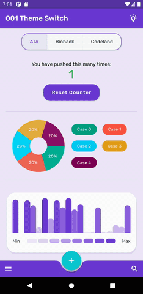
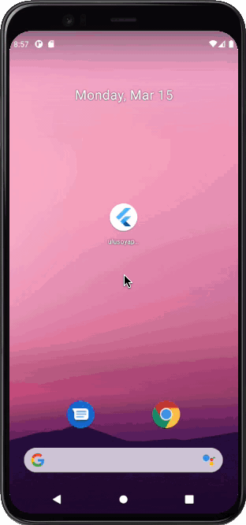
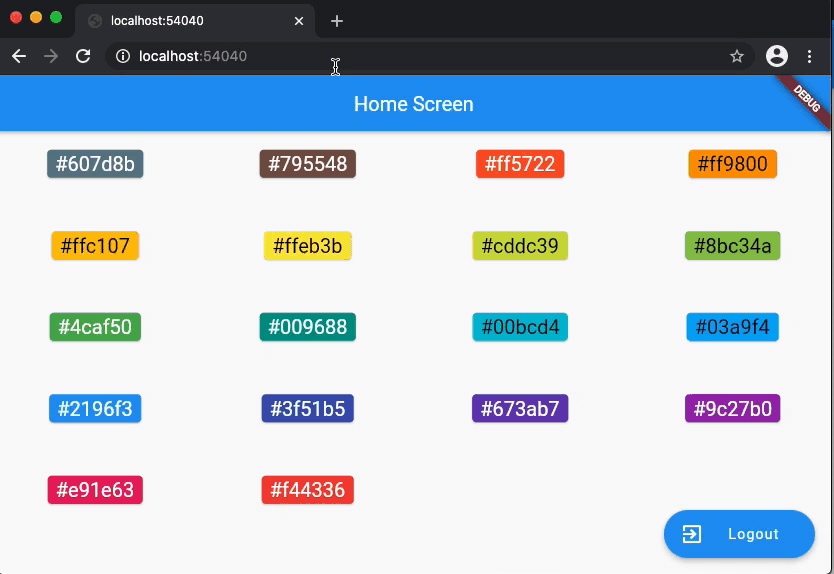

<h1 align="center">Welcome to Flutter ShareWhatYouKnow 👋</h1>
<p>
  <a href="http://www.apache.org/licenses/LICENSE-2.0" target="_blank">
    
  </a>
  <a href="https://twitter.com/ulusoyapps" target="_blank">
    
  </a>
</p>

In this Github repository I share the source code for the tutorial articles that I published. You can find the links to the articles below. Please follow my <a href= "https://ulusoyca.medium.com">Medium page</a> to stay up-to-date whenever I share a new content!

<h2 align="center">001 - THEME SWITCH</h2>

In this series of articles, I talk about implementing a design system
for a Flutter app so that we can easily switch between three themes made
for three different companies.



Imagine you have a B2B app to be used by the customers or employers of
different companies. You can choose to implement only one app theme for
all companies. Alternatively, your app can apply company-specific themes
to increase brand awareness when a user is identified.

It may sound like a big cost to maintain multiple themes in an app, but
when carefully done, it is actually not a big deal. In fact, it forces
you to write cleaner code with separate concerns and less repetition.

There are many blog posts and tutorials on switching between dark and
light themes in Flutter. However, brightness is only one aspect of a
theme. A theme is a collection of attributes that are applied to all
screens of an application. In this article, I discuss how to apply 3
different themes in an app and switching between them.

The distinct theme properties will be color, typography, icons, shape,
and brightness. In the demo project, I implemented themes for the
following imaginary companies: ATA, Biohack, and Codeland. Note that in
the app there are intentional design mistakes which are mentioned in
these posts for demonstration purposes.


Here are the links for the articles:

<li> <a href= "https://medium.com/@ulusoyca/switching-between-client-specific-themes-for-b2b-flutter-apps-part-i-design-c9c501700c0e">Switching Between Client Specific Themes for B2B Flutter Apps - Part I: Design</li>
<li> <a href= "https://medium.com/@ulusoyca/switching-between-client-specific-themes-for-b2b-flutter-apps-part-i-design-c9c501700c0e">Switching Between Client Specific Themes for B2B Flutter Apps - Part II: Implementation</li>

#### Usage (Theme Switch )
To start the app with the command line, first open an iOS simulator,
Android Virtual device, or a physical device. Then type the following
commands on the command line:

```sh
flutter run lib/001-theme-switch-with-providers/main.dart
```

<h2 align="center">002 - NAVIGATOR 2.0</h2>

<a href= "https://medium.com/@ulusoyca/switching-between-client-specific-themes-for-b2b-flutter-apps-part-i-design-c9c501700c0e">Flutter Navigator 2.0 for Authentication and Bootstrapping — Part 1: Introduction</a>

<p>The Navigator 2.0 API gives more control to Flutter developers to implement the application navigation by introducing multiple components with separated responsibilities. When it was announced, many Flutter devs, including me, initially found this new way of navigation complicated and hard to use due to the lack of training materials and samples. The Flutter team is well aware of this situation, and they started
Navigator 2.0 API Usability Research. Anyone can contribute to this research project and engage in the discussions.</p>
<p>I was too close to give up on migrating to the new Navigator API too, but I wanted to get benefit from it for my side project to provide a better Web application user experience. After going through the source code, reading the Github discussions, and experimenting a lot with a demo project, I would like to share my learnings in this series of articles.</p>
<p>The Flutter team presented the Navigator 2.0 API with an article that gives too much information to digest. I think the article could have been split into smaller parts and covered more common scenarios such as authentication, bootstrapping, deep-link handling, etc. I am sure many blog posts from the Flutter community will help to close this gap. I also hope that this series of articles will be useful for the community.</p>

### PART 2: User Interaction

<a href= "https://ulusoyca.medium.com/flutter-navigator-2-0-for-authentication-and-bootstrapping-part-2-user-interaction-5dc043e7e44a">Flutter Navigator 2.0 for Authentication and Bootstrapping — Part 2: User Interaction</a>

<p>In the first sample app, we introduce the Router widget and its delegates. Then we explain how to build a navigation stack according to the app state changes. We focus on the following user interactions causing the app state changes:</p>
<li>Selecting a color and shape border type by pressing the buttons in the lists</li>
<li>Pressing the back button in the app bar</li>
<li>Pressing the system back button (Android only)</li>


#### Usage (Part-2):
To start the app with the command line, first open an iOS simulator,
Android Virtual device, or a physical device. Then type the following
commands on the command line:

```sh
flutter run lib/002-navigator-2/002-01-mobile-only/main_002_01.dart
```

### PART 3: Authentication

<a href= "https://ulusoyca.medium.com/flutter-navigator-2-0-for-authentication-and-bootstrapping-part-3-authentication-93dbcb5f0f0a">Flutter Navigator 2.0 for Authentication and Bootstrapping — Part 3: Authentication</a>

<p>In the second sample, we add the authentication use case and build the navigation stack according to the authentication state changes.</p>


#### Usage (Part-3):
To start the app with the command line, first open an iOS simulator,
Android Virtual device, or a physical device. Then type the following
commands on the command line:

```sh
flutter run lib/002-navigator-2/002-02-mobile-only-with-auth/main_002_02.dart
```

### PART 4: Bootstrapping

<a href= "https://ulusoyca.medium.com/flutter-navigator-2-0-for-authentication-and-bootstrapping-part-4-bootstrapping-6ff60c845331">Flutter Navigator 2.0 for Authentication and Bootstrapping — Part 4: Bootstrapping</a>

<p>In the fourth sample, we we handle the bootstrapping process and build the navigation stack accordingly.</p>



#### Usage (Part-4):
To start the app with the command line, first open an iOS simulator,
Android Virtual device, or a physical device. Then type the following
commands on the command line:

```sh
flutter run lib/002-navigator-2/002-03-mobile-only-with-auth-and-bootstrap/main_002_03.dart
```

### PART 5: Web

<a href= "https://ulusoyca.medium.com/flutter-navigator-2-0-for-authentication-and-bootstrapping-part-5-web-eeb4835804df">Flutter Navigator 2.0 for Authentication and Bootstrapping — Part 5: Web</a>

<p>In the fourth sample, we focus on two things:</p>
<li>Application state changes caused by user interaction, authentication state update, and bootstrapping.</li>
<li>Popping the current route requests from the operating system.</li>



#### Usage (Part-5):
To start the app with the command line type the following commands on the command line:

```sh
flutter run -d chrome lib/002-navigator-2/002-04-mobile-and-web-with-auth-and-bootstrap/main_002_04.dart
```

## Author

👤 **Cagatay Ulusoy**

* Twitter: [@ulusoyapps](https://twitter.com/ulusoyapps)
* Github: [@ulusoyca](https://github.com/ulusoyca)
* LinkedIn:
  [@https:\/\/www.linkedin.com\/in\/cagatayulusoy\/](https://linkedin.com/in/https:\/\/www.linkedin.com\/in\/cagatayulusoy\/)

## Show your support

Give a ⭐️ if this project helped you!

## 📝 License

Copyright © 2020 [Cagatay Ulusoy](https://github.com/ulusoyca).<br />
This project is
[Apache License, Version 2.0 (the &#34;License&#34;)](http://www.apache.org/licenses/LICENSE-2.0)
licensed.

***

_This README was generated with ❤️ by
[readme-md-generator](https://github.com/kefranabg/readme-md-generator)_
